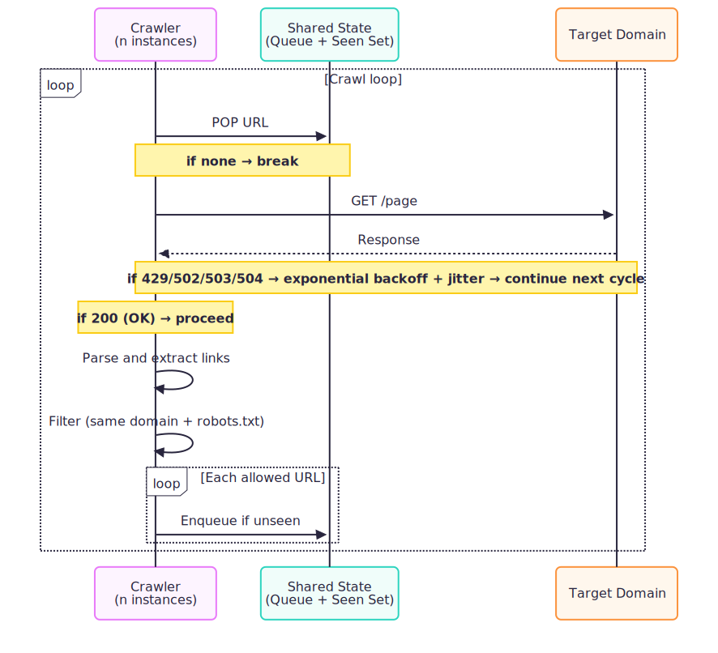

# Monzo Domain Crawler


A simple, yet robust web crawler demonstrating best practices in software design, concurrency, resilience, and compliance.

[](https://github.com/tvergilio/monzo-domain-crawler/actions/workflows/ci.yml)


<i>This is an educational/sample project and not an official Monzo product.</i>

---

## Overview

The Monzo Domain Crawler visits all pages on a single domain, starting from a seed URL. It prints each visited URL and the links found, strictly limiting traversal to the same domain and respecting robots.txt. The system is stateless, horizontally scalable, and built for clarity and reliability.

---

## Architecture




- **Crawler Service (Stateless)**: Multiple instances can run in parallel (dockerised and Kubernetes-ready).
- **Redis**: Centralised queue and deduplication (seen set) for distributed crawling. Atomic enqueueing and dequeueing.
- **Internet**: Target domain is crawled; only same-domain links are followed.

---

## Key Design Decisions

- **FrontierQueue Interface**: Abstracts queueing, enabling alternative backends (e.g., in-memory, Redis, Kafka).
- **RedisFrontierQueue**: Production-grade implementation using Redis for both queue and deduplication, supporting atomic operations and distributed scale.
- **Robots.txt Compliance**: Per-host rules fetched once per instance and cached in-memory for responsible crawling; only same-domain URLs considered.
- **Concurrency**: Virtual threads allow a straightforward blocking style while supporting high concurrency.
- **Configuration**: All operational parameters (parallelism, timeouts, backoff, etc.) are externally configurable.
- **Observability**: Structured logging (SLF4J), coverage (JaCoCo) and CI pipeline (GitHub Actions). Metrics/tracing earmarked for future.

---

## Delivery Process and Backlog

Development followed a professional, iterative workflow:

- **Feature branches** for each backlog item (see [Delivery Backlog](docs/DELIVERY_BACKLOG.md)).
- **Pull requests and CI**: Every change reviewed; automated build, test, coverage via GitHub Actions ([CI Results](https://github.com/tvergilio/monzo-domain-crawler/actions)).
- **Traceability**: The [Delivery Backlog](docs/DELIVERY_BACKLOG.md) lists user stories, acceptance criteria, priority and status.

---

## Sequence Flow



<div align="center"><em>Sequence Flow: Per-URL processing lifecycle (pop → fetch → filter → enqueue).</em></div>

---

## Redis Data Flow



<div align="center"><em>Redis Data Flow: Atomic enqueue + distributed dequeue across crawler instances.</em></div>

---

## Class Structure



<div align="center"><em>Class Structure: High-level relationships (frontier abstraction, fetcher, robots handler).</em></div>

---

## Quality and Resilience



<div align="center"><em>Observability: Structured logs, coverage reports; metrics/tracing earmarked (see Future Development).</em></div>

---


## Configuration

Configuration is loaded from `crawler-config.yaml`. Redis host/port can be overridden via environment variables (`REDIS_HOST`, `REDIS_PORT`).
The configuration is extensible via `CrawlerConfig.builderFromYaml()` for custom sources or advanced use.

---

## How to Run
Prerequisites: Docker, JDK 21+.

1. Clone the repo and ensure Docker is installed.
2. Start the full stack (crawler and Redis) with:
   ```sh
   docker-compose up --build
   ```
3. To scale the crawler service for parallelism, run:
   ```sh
   docker-compose up --scale crawler=3
   ```
   Replace `3` with the desired number of crawler instances.
4. View logs and output in the terminal.
5. To run tests and generate coverage locally (optional):
   ```sh
   ./gradlew clean build
   open build/reports/jacoco/test/html/index.html
   ```

---

## Trade-offs

- **Redis for Queue and Deduplication**: Chosen for atomicity, distributed scale and operational simplicity.
- **Stateless Crawler**: Enables horizontal scaling and resilience to failure.
- **In-memory robots.txt cache**: Fast, per-instance; could be centralised for large-scale crawling.
- **Virtual threads vs classic thread pool**: Virtual threads (Project Loom) provide lightweight, scalable concurrency with a simple blocking style, avoiding the complexity and resource overhead of traditional thread pools.
- **No external frameworks**: All crawling logic is custom, as per brief.

### Limitations

- No rate limiting / crawl-delay yet.
- No persistent robots cache across instances.
- Output only to stdout.
- Stops when frontier empty; no restart persistence snapshot beyond Redis AOF.

---

## Future Development

- **Politeness and Compliance**: Centralised (shared) robots.txt cache, per-host rate limiting / crawl delay, adaptive backoff.
- **Frontier Evolution**: Migrate from a Redis List to a Kafka topic for durable, replayable frontier management. Later add Flink job (enrichment, prioritisation, rate limiting) when scale justifies.
- **Observability**: Prometheus metrics (pages fetched, queue depth, error counts), optional OpenTelemetry tracing if more services are added.
- **Output Persistence**: Pluggable sinks (JSONL file, S3/object storage, database, or webhook) instead of stdout only.
- **Adaptive Concurrency**: Dynamically adjust worker count based on queue depth, median fetch latency, retriable error ratio.

---

## Contact

Thalita Vergilio  
[thalita.vergilio@yahoo.co.uk](mailto:thalita.vergilio@yahoo.co.uk)

---

<sup>Designed and implemented for Monzo, July 2025.</sup>
